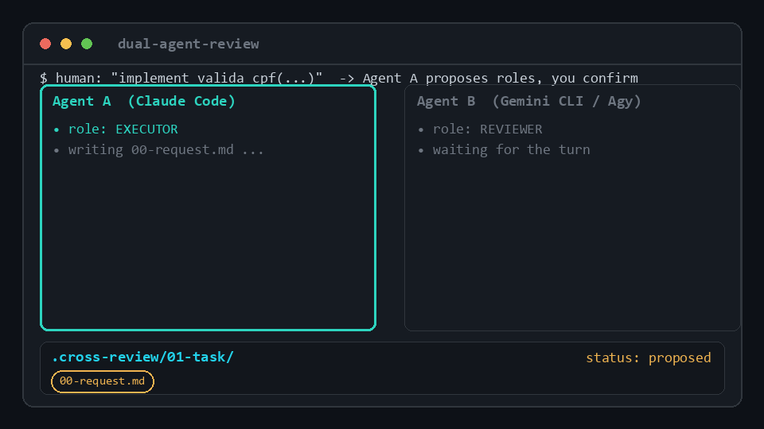
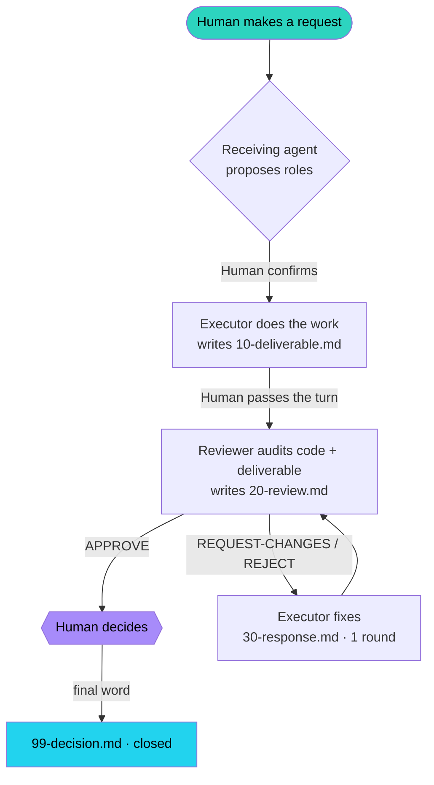

# dual-agent-review

**English** · [Português](README.pt-BR.md)

[](LICENSE)
[](https://claude.com/claude-code)
[](https://github.com/google-gemini/gemini-cli)
[](#)

**A cross-review protocol for two terminal coding agents.** One agent executes, the other audits
its quality, and **a human makes the final call.** Built for [Claude Code](https://claude.com/claude-code)
(Anthropic) and the [Gemini CLI](https://github.com/google-gemini/gemini-cli) (Google) working side
by side on the same repo — but the protocol is agent-agnostic.



> One executes, the other audits through a shared `.cross-review/` folder, roles are decided
> per-task by the human, **and the final decision is always the human's.**

---

## The problem

Running two agentic coding tools is increasingly common — say Claude Code in one terminal and the
Gemini CLI in another. But out of the box:

- **They're isolated.** Two separate terminal processes can't call each other. Whatever one writes,
  the other never sees.
- **Nobody audits anybody.** Each agent ships its own work unchecked. The blind spots of one model
  are exactly the things it won't catch in its own output.
- **The decision has no owner.** When work is "done," it's unclear who approved it or on what basis.

## The solution

A lightweight, file-based handoff protocol plus mirrored instructions on both agents, so that on
**every non-trivial request** — made to *either* agent — one **executes** and the other **audits**,
and the **human decides**. No API bridge, no orchestration server: the agents coordinate through a
shared `.cross-review/` folder in the repo, and the human passes the turn between terminals and
gives the final verdict.



The human is the circuit breaker: **no agent closes a contested change on its own.**

---

## Components

| Piece | What it is | Where it goes |
|---|---|---|
| [`PROTOCOL.md`](PROTOCOL.md) | Canonical spec — state machine, file formats, review contract | reference for both agents |
| [`claude/CLAUDE.md`](claude/CLAUDE.md) | Cross-review instructions for the **Claude Code** side | paste into `~/.claude/CLAUDE.md` |
| [`gemini/GEMINI.md`](gemini/GEMINI.md) | Cross-review instructions for the **Gemini CLI** side | copy to `~/.gemini/GEMINI.md` |
| [`templates/cross-review/`](templates/cross-review) | Markdown templates for each handoff file | used by the bootstrap script |
| [`tools/cross-review-init.sh`](tools/cross-review-init.sh) | Scaffolds `.cross-review/` in any project | run from a repo root |
| [`examples/dryrun-valida-cpf/`](examples/dryrun-valida-cpf) | A real, completed review cycle | worked example |

### The `.cross-review/` folder

Lives at the project root, **gitignored by default** (it's scratch coordination). One subfolder
per task:

```
.cross-review/
  <NN-slug>/
    00-request.md       # normalized request + roles/status frontmatter   (whoever receives)
    10-deliverable.md   # what was done + pointers to the real code        (executor)
    20-review.md        # verdict + numbered findings                      (reviewer)
    30-response.md      # optional rebuttal, 1 round                        (executor)
    99-decision.md      # the human's final word                           (human)
```

`status` drives the handoff: `proposed → awaiting-executor → awaiting-review →
awaiting-user-decision → closed`. When an agent opens a project with a `.cross-review/`, it scans
the `00-request.md` files and acts on the task whose `status` matches its role.

---

## Setup

1. **Install both agents** — [Claude Code](https://claude.com/claude-code) and the
   [Gemini CLI](https://github.com/google-gemini/gemini-cli), authenticated, on the same machine.
2. **Wire the Claude side:** copy the contents of [`claude/CLAUDE.md`](claude/CLAUDE.md) into your
   `~/.claude/CLAUDE.md` (create it if needed). Adjust the path to `PROTOCOL.md` to wherever you
   keep this repo.
3. **Wire the Gemini side:** copy [`gemini/GEMINI.md`](gemini/GEMINI.md) to `~/.gemini/GEMINI.md`
   (the Gemini CLI loads it as global context automatically).
4. **Make the kit reachable:** clone this repo somewhere stable and either add
   `tools/cross-review-init.sh` to your `PATH` or call it by full path. It finds the templates
   relative to itself — no configuration needed.
5. **Ignore the handoff folder globally (optional):** add `/.cross-review/` to your global gitignore
   (`~/.config/git/ignore`). The bootstrap script also adds it per-repo.

Then, in any project, the flow just happens: ask either agent for something non-trivial and it will
propose roles and start a `.cross-review/` task.

---

## The review contract

When an agent is the **reviewer**, it audits — and emits a verdict
`APPROVE | REQUEST-CHANGES | REJECT` with **numbered findings** (severity `blocker/major/minor/nit`,
a `file:line` pointer, and a suggested fix):

- **Correctness + edge cases** — does it do what it claims and survive bad input?
- **Meets the request** — does it satisfy `00-request.md` and the acceptance criteria?
- **Respects project conventions** — your fixed-decisions / style doc, if you keep one.
- **Objective quality** — tests green, linter clean, no dead code.
- **Honesty** — no fabricated metrics; evaluation against real ground truth.

Capped at **1 rebuttal round** so it can't loop. The human can end it at any point.

---

## Worked example

[`examples/dryrun-valida-cpf/`](examples/dryrun-valida-cpf) is a real cycle: the executor shipped a
Brazilian-CPF validator with a subtle planted bug (it accepts CPFs of all-identical digits, which
pass the checksum but are invalid). The reviewer caught it as a **Blocker** — *and* flagged a second
genuine bug nobody planted (permissive non-numeric stripping). That's the point of the protocol: the
second agent sees what the first one's blind spot hides.

[`examples/payments-aggregation/`](examples/payments-aggregation) is a **harder** cycle that exercises
the full protocol including a rebuttal round: a payments-aggregation module that passed `ruff` + tests
while hiding **6 bugs** (float money, mutable-default state leak, refund sign, mixed-currency
summation, off-by-one window, empty-list division). The reviewer caught **all 6 plus the shallow-test
gap, with no false positives**, then on re-review confirmed the fixes and routed the one API decision
to the human.

---

## How it compares

The differential here is **design and ergonomics**, not a new AI technique. In one line:

> **Two models from rival vendors auditing each other, with no API bridge — just a folder and the
> human as decider.** Most similar projects miss at least one of those three.

| Category | Examples | What they do | What's different here |
|---|---|---|---|
| Multi-agent orchestration | LangGraph, CrewAI, AutoGen | Agents in the **same process**, handoff via code/API | Two **independent CLIs** that share no process or API; transport is the filesystem + the human. It works *because* they don't talk directly. |
| LLM-as-judge / self-reflection | Reflexion, self-critique | **The same model** critiques its own output | The reviewer is a **different vendor** (Anthropic ⇄ Google) — genuinely different blind spots, not a model grading itself. |
| AI code-review bots | CodeRabbit, Greptile, Copilot review | Review a **PR on GitHub**, after the fact, in CI | **Local, real-time, pre-commit**, between two interactive agents, human deciding per task. |
| Agent-to-agent protocols | A2A, MCP, AutoGen chats | Agents call each other via **API/protocol** | **Zero-integration**: gitignored markdown. Survives restarts, the audit trail is plain files, adoption cost is copying two files. |

**The three pillars that, together, nothing else combines:**

1. **Cross-vendor, not self-review** — model diversity *is* the feature. The CPF example proves it:
   the reviewer caught the planted bug *and* one nobody planted.
2. **Transport-agnostic, no orchestration** — not a new app or runtime; it lives in the agents' own
   instruction layer (`CLAUDE.md` / `GEMINI.md`).
3. **Human as circuit breaker, by design** — not two AIs auto-merging; the human sets roles per task
   and gives the final verdict. The safety property *is* the human in the loop.

**Being fair — where it's _not_ special:** this is a well-designed workflow convention, not AI
research. It's technically simple ("it's just a folder of markdown" is a fair critique — the
simplicity is the point), and it's **manual**: the human shuttles the turn, so fully auto-orchestrated
frameworks are more hands-off. That trade-off is deliberate.

---

## Why it works (and its limits)

- **No orchestration needed.** The shared folder + a human passing the turn is the entire transport.
  It survives either agent restarting, and the audit trail is just files.
- **The human owns the decision.** This isn't two AIs auto-merging each other's work; it's two AIs
  surfacing each other's blind spots so a person decides with more information.
- **Limit: it's not fully automatic.** Because the agents can't call each other, the human shuttles
  the turn between terminals. That's a deliberate trade-off — the human-in-the-loop *is* the safety
  property.

---

## License

MIT — see [LICENSE](LICENSE).
