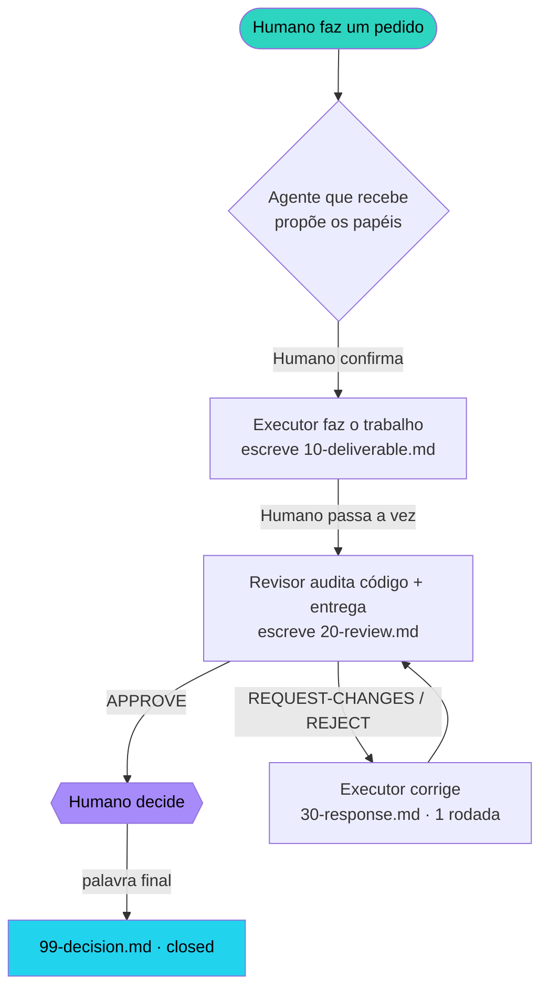

# dual-agent-review

[English](README.md) · **Português**

[](LICENSE)
[](https://claude.com/claude-code)
[](https://github.com/google-gemini/gemini-cli)
[](#)

**Um protocolo de cross-review entre dois agentes de terminal.** Um agente executa, o outro audita a
qualidade, e **o humano dá a palavra final.** Feito para o [Claude Code](https://claude.com/claude-code)
(Anthropic) e o [Gemini CLI](https://github.com/google-gemini/gemini-cli) (Google) trabalhando lado a
lado no mesmo repositório — mas o protocolo é agnóstico de agente.


> Um executa, o outro audita através de uma pasta compartilhada `.cross-review/`, os papéis são
> decididos por tarefa pelo humano, **e a decisão final é sempre dele.**

---

## O problema

Rodar duas ferramentas de coding agêntico está cada vez mais comum — digamos o Claude Code num
terminal e o Gemini CLI em outro. Mas, do jeito que vêm:

- **Eles são isolados.** Dois processos de terminal separados não conseguem se chamar. O que um
  escreve, o outro nunca vê.
- **Ninguém audita ninguém.** Cada agente entrega o próprio trabalho sem revisão. Os pontos cegos
  de um modelo são exatamente o que ele não vai pegar na própria saída.
- **A decisão não tem dono.** Quando o trabalho "fica pronto", não está claro quem aprovou nem com
  base em quê.

## A solução

Um protocolo de handoff leve, baseado em arquivos, mais instruções espelhadas nos dois agentes, de
forma que em **todo pedido não-trivial** — feito a *qualquer um* dos agentes — um **executa** e o
outro **audita**, e o **humano decide**. Sem ponte de API, sem servidor de orquestração: os agentes
se coordenam por uma pasta compartilhada `.cross-review/` no repositório, e o humano passa a vez
entre os terminais e dá o veredito final.



O humano é o disjuntor: **nenhum agente fecha sozinho uma mudança contestada.**

---

## Componentes

| Peça | O que é | Onde vai |
|---|---|---|
| [`PROTOCOL.md`](PROTOCOL.md) | Spec canônica — máquina de estados, formatos, contrato de revisão | referência para os dois agentes |
| [`claude/CLAUDE.md`](claude/CLAUDE.md) | Instruções de cross-review do lado **Claude Code** | colar em `~/.claude/CLAUDE.md` |
| [`gemini/GEMINI.md`](gemini/GEMINI.md) | Instruções de cross-review do lado **Gemini CLI** | copiar para `~/.gemini/GEMINI.md` |
| [`templates/cross-review/`](templates/cross-review) | Templates markdown de cada arquivo de handoff | usados pelo script de bootstrap |
| [`tools/cross-review-init.sh`](tools/cross-review-init.sh) | Cria o `.cross-review/` em qualquer projeto | rodar da raiz de um repo |
| [`examples/dryrun-valida-cpf/`](examples/dryrun-valida-cpf) | Um ciclo de revisão real e completo | exemplo trabalhado |

### A pasta `.cross-review/`

Fica na raiz do projeto, **ignorada no git por padrão** (é coordenação scratch). Uma subpasta por
tarefa:

```
.cross-review/
  <NN-slug>/
    00-request.md       # pedido normalizado + frontmatter de papéis/status   (quem recebe)
    10-deliverable.md   # o que foi feito + ponteiros pro código real          (executor)
    20-review.md        # veredito + achados numerados                         (revisor)
    30-response.md      # rebuttal opcional, 1 rodada                          (executor)
    99-decision.md      # a palavra final do humano                            (humano)
```

`status` dirige o handoff: `proposed → awaiting-executor → awaiting-review →
awaiting-user-decision → closed`. Quando um agente abre um projeto com `.cross-review/`, ele varre os
arquivos `00-request.md` e age na tarefa cujo `status` casa com o seu papel.

---

## Setup

1. **Instale os dois agentes** — [Claude Code](https://claude.com/claude-code) e o
   [Gemini CLI](https://github.com/google-gemini/gemini-cli), autenticados, na mesma máquina.
2. **Configure o lado Claude:** copie o conteúdo de [`claude/CLAUDE.md`](claude/CLAUDE.md) para o seu
   `~/.claude/CLAUDE.md` (crie se não existir). Ajuste o caminho do `PROTOCOL.md` pra onde você
   guarda este repo.
3. **Configure o lado Gemini:** copie [`gemini/GEMINI.md`](gemini/GEMINI.md) para `~/.gemini/GEMINI.md`
   (o Gemini CLI carrega como contexto global automaticamente).
4. **Deixe o kit acessível:** clone este repo num lugar estável e adicione o
   `tools/cross-review-init.sh` ao `PATH` ou chame pelo caminho completo. Ele acha os templates
   relativo a si mesmo — sem configuração.
5. **Ignore a pasta de handoff globalmente (opcional):** adicione `/.cross-review/` ao seu gitignore
   global (`~/.config/git/ignore`). O script de bootstrap também adiciona por repo.

Aí, em qualquer projeto, o fluxo simplesmente acontece: peça algo não-trivial a qualquer um dos
agentes e ele vai propor os papéis e começar uma tarefa em `.cross-review/`.

---

## O contrato de revisão

Quando um agente é o **revisor**, ele audita — e emite um veredito
`APPROVE | REQUEST-CHANGES | REJECT` com **achados numerados** (severidade
`blocker/major/minor/nit`, ponteiro `arquivo:linha`, e correção sugerida):

- **Correção + edge cases** — faz o que diz e aguenta entrada ruim?
- **Atende o pedido** — satisfaz o `00-request.md` e os critérios de aceite?
- **Respeita as convenções do projeto** — seu doc de decisões fixas / estilo, se você tiver um.
- **Qualidade objetiva** — testes verdes, linter limpo, sem código morto.
- **Honestidade** — nenhuma métrica inventada; avaliação contra ground-truth real.

Limitado a **1 rodada de rebuttal** pra não loopar. O humano pode encerrar a qualquer momento.

---

## Exemplo trabalhado

[`examples/dryrun-valida-cpf/`](examples/dryrun-valida-cpf) é um ciclo real: o executor entregou um
validador de CPF com um bug sutil plantado (aceita CPFs de dígitos todos iguais, que passam no
checksum mas são inválidos). O revisor pegou como **Blocker** — *e* ainda apontou um segundo bug
genuíno que ninguém tinha plantado (limpeza permissiva de não-numéricos). É esse o ponto do
protocolo: o segundo agente enxerga o que o ponto cego do primeiro esconde.

[`examples/payments-aggregation/`](examples/payments-aggregation) é um ciclo **mais difícil**, que
exercita o protocolo inteiro incluindo uma rodada de rebuttal: um módulo de agregação de pagamentos
que passava em `ruff` + testes escondendo **6 bugs** (float pra dinheiro, default mutável vazando
estado, sinal de refund, soma de moedas misturadas, off-by-one na janela, divisão por lista vazia). O
revisor pegou **todos os 6 + o gap de cobertura dos testes, sem falso positivo**, e no re-review
confirmou as correções e roteou a única decisão de API pro humano.

---

## Como se compara

O diferencial aqui é de **design e ergonomia**, não uma técnica nova de IA. Em uma frase:

> **Dois modelos de fabricantes rivais auditando um ao outro, sem nenhuma ponte de API — só uma pasta
> e o humano como decisor.** A maioria dos projetos parecidos falha em pelo menos um desses três.

| Categoria | Exemplos | O que fazem | O diferencial aqui |
|---|---|---|---|
| Orquestração multi-agente | LangGraph, CrewAI, AutoGen | Agentes no **mesmo processo**, handoff via código/API | Duas **CLIs independentes** que não compartilham processo nem API; o transporte é o filesystem + o humano. Funciona *porque* não se falam direto. |
| LLM-as-judge / self-reflection | Reflexion, self-critique | **O mesmo modelo** critica a própria saída | O revisor é de **outro fabricante** (Anthropic ⇄ Google) — pontos cegos genuinamente diferentes, não o modelo se autoavaliando. |
| Bots de code review | CodeRabbit, Greptile, Copilot review | Revisam **PR no GitHub**, depois do fato, em CI | **Local, em tempo real, pré-commit**, entre dois agentes interativos, com o humano decidindo por tarefa. |
| Protocolos agente-a-agente | A2A, MCP, AutoGen chats | Agentes se chamam via **API/protocolo** | **Zero-integração**: markdown gitignored. Sobrevive a restart, a trilha de auditoria são arquivos puros, adoção = copiar dois arquivos. |

**Os três pilares que, juntos, nada mais combina:**

1. **Cross-vendor, não auto-revisão** — diversidade de modelo *é* a feature. O exemplo do CPF prova:
   o revisor pegou o bug plantado *e* um que ninguém plantou.
2. **Transporte agnóstico, sem orquestração** — não é um app/runtime novo; vive na própria camada de
   instrução dos agentes (`CLAUDE.md` / `GEMINI.md`).
3. **Humano como disjuntor, por design** — não são duas IAs fazendo auto-merge; o humano define os
   papéis por tarefa e dá o veredito final. A propriedade de segurança *é* o humano no loop.

**Sendo justo — onde _não_ é diferenciado:** isto é uma convenção de workflow bem desenhada, não
pesquisa de IA. É tecnicamente simples ("é só uma pasta de markdown" é uma crítica válida — a
simplicidade é o ponto), e é **manual**: o humano leva a vez, então frameworks 100% auto-orquestrados
são mais hands-off. É um trade-off proposital.

---

## Por que funciona (e seus limites)

- **Sem orquestração.** A pasta compartilhada + o humano passando a vez são todo o transporte. Sobrevive a
  qualquer agente reiniciar, e a trilha de auditoria são só arquivos.
- **O humano é dono da decisão.** Não são duas IAs fazendo auto-merge do trabalho uma da outra; são
  duas IAs expondo os pontos cegos uma da outra pra uma pessoa decidir com mais informação.
- **Limite: não é totalmente automático.** Como os agentes não se chamam direto, o humano leva a vez
  entre os terminais. É um trade-off proposital — o humano no loop *é* a propriedade de segurança.

---

## Licença

MIT — veja [LICENSE](LICENSE).
